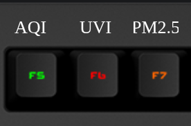

# Q Applet: Air Quality Monitor

Monitor your local air quality conditions directly on your Das Keyboard Q series.  
Displays live metrics for **AQI**, **UV Index**, and **PM2.5** using color-coded key signals.

## Example

Air Quality Monitor on 3 adjacent keys.

## Changelog

[CHANGELOG.md](CHANGELOG.md)

## Installation

Requires a Das Keyboard Q series: https://www.daskeyboard.com

Installation, configuration and uninstallation of applets is done within
the Q Desktop application: <https://www.daskeyboard.com/q>

## Running tests

    yarn test

## Contributions

Pull requests welcome.
